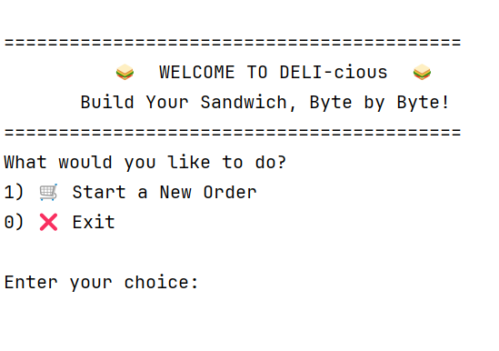
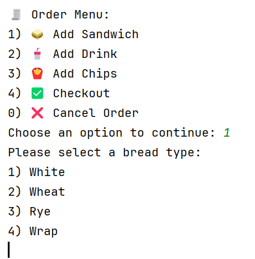
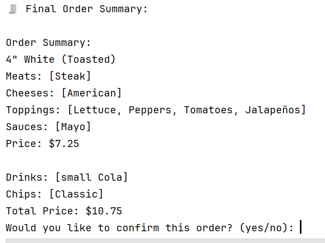

# 🥪 DELI-cious – Capstone Java CLI Ordering App

**Build Your Sandwich, Byte by Byte!**

DELI-cious is a command-line Java application that simulates a point-of-sale system for a sandwich shop. Users can create customized sandwich orders, add drinks and chips, and save receipts. This project demonstrates solid object-oriented programming (OOP) practices, designed as part of my Java OOP capstone at Year Up.

---

## 🚀 Features

- Fully interactive CLI interface for ordering
- Custom sandwich builder:
  - Bread type (white, wheat, rye, wrap)
  - Size (4", 8", 12")
  - Toasted option
  - Add meats, cheeses, regular toppings, sauces (with extras)
- Add drinks and chips
- Save order receipts with timestamped filenames
- NEW! 🧃 Combo option — sandwich + drink + chips
- Clean OOP design and user-friendly interface

  
  
  

---

## 🧠 OOP Concepts Applied

- **Encapsulation** — Order, Sandwich, Topping classes
- **Composition** — Sandwich contains toppings, sauces, etc.
- **Separation of Concerns** — `UserInterface` handles interaction, `Order` manages data
- **Polymorphism / Inheritance** — Signature sandwiches (if implemented)

---

## ✨ Special Code Highlight

```java
System.out.print("Would you like to make it a combo? (yes/no): ");
if (scanner.nextLine().equalsIgnoreCase("yes")) {
    displayDrinkOptions(order);
    displayChipOptions(order);
}

---
