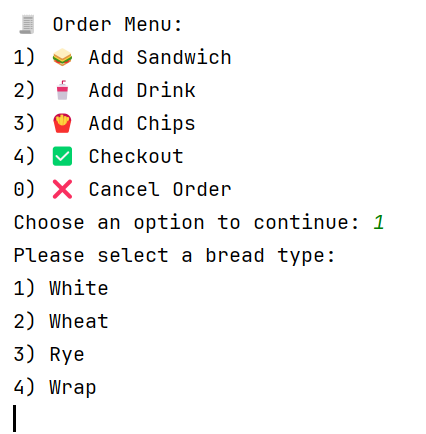

# DELI-cious · Sandwich ordering in Java

A terminal-based sandwich shop: build a sandwich, add drinks and chips, review the price, and save a receipt. Created as a Java object-oriented programming capstone.



## Features

- 4-, 8-, and 12-inch sandwiches with bread, meat, cheese, toppings, and sauces.
- Premium ingredients and extra portions change the price.
- Combo ordering adds a drink and chips at their normal prices.
- Checkout writes a uniquely named text receipt under `receipts/`.
- Numeric input retries instead of crashing; unsupported sizes are rejected.

## Run

Install Java 17 and Maven 3.9+, then:

```bash
git clone https://github.com/LesleyCloud1/DELI-cious.git
cd DELI-cious
mvn test
mvn package
java -cp target/classes com.pluralsight.Application
```

Choose **1** to start an order. Add a sandwich, drink, or chips. Choose **4** to review and confirm checkout, or **0** to cancel. Receipts are written relative to the directory where you run the app.

## Example price

An 8-inch sandwich ($7), turkey ($2), extra turkey ($1), cheddar ($1.50), extra cheddar ($0.60), a medium drink ($2.50), and chips ($1.50) total **$16.10**. Regular toppings and sauces add no charge. This scenario is covered by a test.

## Code map

`Application` → `UserInterface` → `Sandwich` / `Order` → `ReceiptWriter`

`MenuOptions` holds the choices. `Sandwich` owns ingredient pricing. `Order` groups items and totals them. `ReceiptWriter` handles files. Read [the code tour](docs/CODE_TOUR.md) for a guided example.

## Scope and next steps

The app demonstrates composition, encapsulation, lists, loops, validation, and file I/O. There is no payment gateway, database, or signature-sandwich inheritance hierarchy. Prices currently use `double`; a future money model should use decimal values. Empty checkout and end-of-input handling are future improvements.
